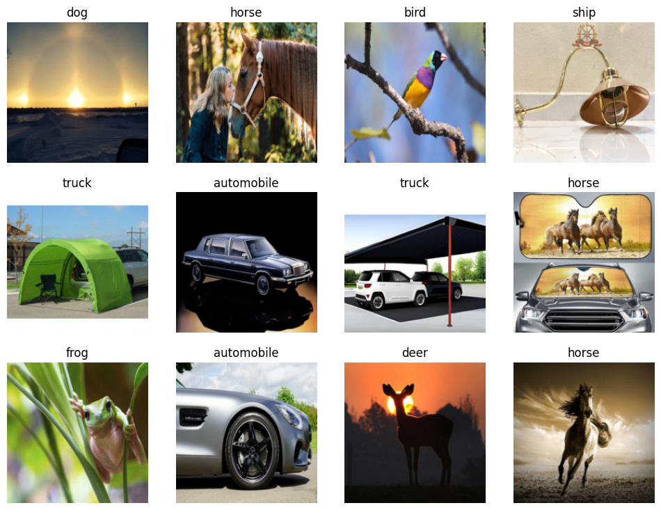
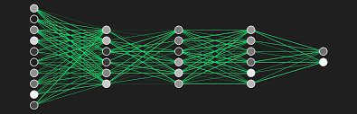

# The Multiclass Classifier (CIFAR10 Classes)

## Is it a airplane, automobile, bird, cat, deer, dog, frog, horse, ship or truck?

The basic steps taken are as follows:
1. Use DuckDuckGo to search for images of airplanes, automobiles, birds, cats, deer, dogs, frogs, horses, ships and trucks
1. Fine-tune a pretrained neural network to recognise these groups (resnet18)
1. Try running this model on a picture of an airplane and see if it works.

## Step 1) Data collection
In the first step you can scrape as many images as you would like for each class from the DuckDuckGo search engine to produce a data set for training the nural net. this can be done by defining how maney images you want along with a for loop pulling images with different search prompts of for each class item you want to identify.

## Step 2) Fine-tunning a pretrained nural network

We use a multiclass image classifier which is a nural network (NN) that can be passed the pixel values of an image and output a correlation percentage for each class being analysed. 

There is a great thing though called pretrained models, in this we use a resnet18 model. These pretrained models are models with pre-defined layers and corresponding loss functions to optimaly do milticlass classification files.
With a pretrained model we can just fine-tune the model by propogating the dataset through for a few epochs to adjust the weights. Additionaly the output layer will need altering to output the correct number of classes desired.  

## Step 3) Model validation
you can validate your model on a test set and determine the quality of the model and display the output on a t-SNE plot.

